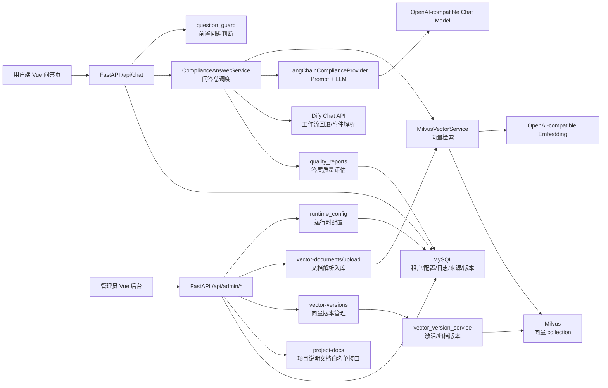
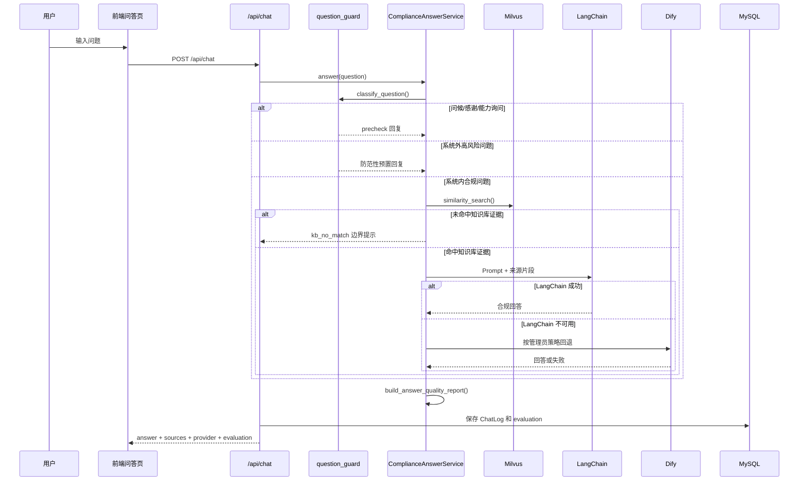
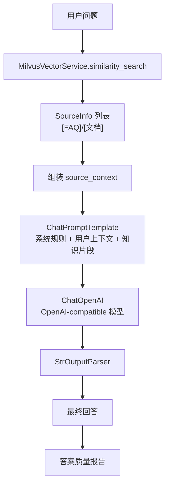
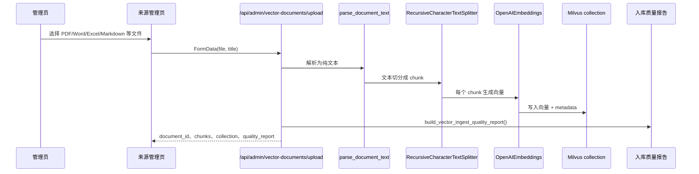
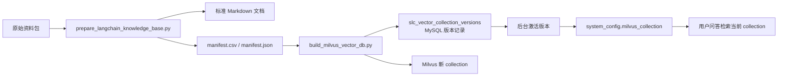
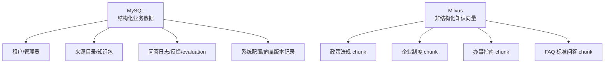
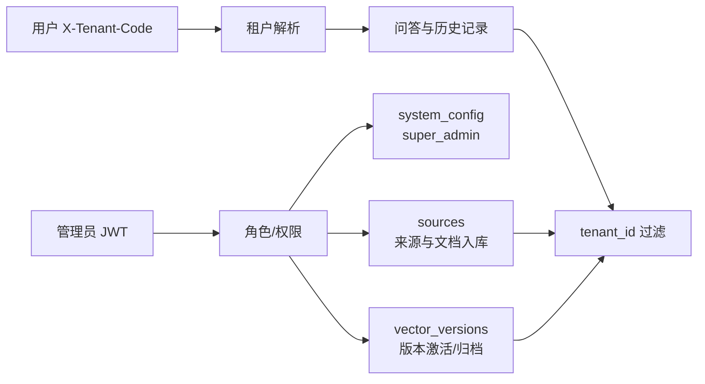
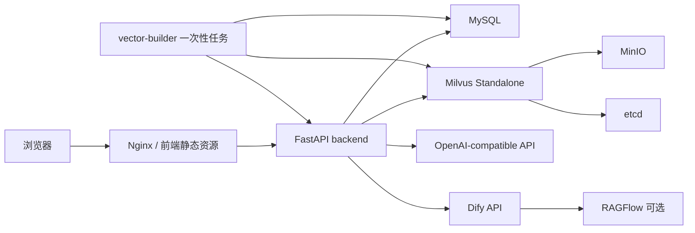

# 企业用工与社保合规智能平台技术架构

本文面向第一次接触项目的人，说明系统由哪些部分组成、用户提问如何被处理、资料如何进入 Milvus 向量库，以及管理员如何控制 LangChain 与 Dify 链路。

## 1. 总体架构



简单理解：

- `Vue` 负责页面交互：用户问答、后台配置、资料上传、向量版本切换。
- `FastAPI` 是所有业务入口：权限、租户隔离、日志、配置、问答调度都在这里。
- `MySQL` 保存结构化业务数据：租户、管理员、来源目录、问答日志、反馈、系统配置、向量版本记录。
- `Milvus` 保存知识库向量：政策法规、企业制度、办事指南、FAQ 标准问答都变成 chunk 向量后存这里。
- `LangChain` 负责把 Milvus 检索片段放进 Prompt，再调用 OpenAI-compatible 模型生成回答。
- `Dify` 作为兼容回退和附件解析链路，管理员可选择优先级。
- 项目说明文档中心通过前端 `/project-docs` 独立访问，后端只暴露白名单接口 `/api/project-docs`；前端 `/docs` 仅兼容跳转，后端 `/docs` 仍是 Swagger/OpenAPI。

## 2. 后端模块分工

| 模块 | 位置 | 作用 |
| --- | --- | --- |
| 问答路由 | `backend/app/routers/chat.py` | 接收用户问题、调用问答服务、保存问答日志 |
| 管理路由 | `backend/app/routers/admin.py` | 系统配置、来源管理、文档入库、向量版本管理 |
| 问答总调度 | `backend/app/services/dify_service.py` | 决定走 LangChain、Dify、前置回复还是知识库边界提示 |
| LangChain 模型链 | `backend/app/services/langchain_provider.py` | 组装 Prompt，调用聊天模型，返回文本答案 |
| Milvus 向量服务 | `backend/app/services/milvus_vector_service.py` | 文档解析、切分、Embedding、入库、相似度检索 |
| 运行时配置 | `backend/app/services/runtime_config.py` | 合并 `.env` 和后台系统配置，校验配置合法性 |
| 质量报告 | `backend/app/services/quality_reports.py` | 对答案和文档入库结果做规则化评分 |
| 向量版本 | `backend/app/services/vector_version_service.py` | 记录、激活、归档 Milvus collection 版本 |
| 批量构建脚本 | `backend/scripts/build_milvus_vector_db.py` | 从 `manifest.csv` 自动构建 Milvus 向量库版本 |
| 知识库整理脚本 | `scripts/prepare_langchain_knowledge_base.py` | 把原始资料整理成 Markdown、manifest 和上传计划 |
| 项目说明文档接口 | `backend/app/routers/project_docs.py` | 只读取白名单 Markdown，供前端 `/project-docs` 在线预览 |

## 3. 用户问答流程



关键规则：

- 简单问候不会调用 Milvus、LangChain 或 Dify，直接 `provider=precheck`。
- 劳动合同、工资、社保、医保、假期、工伤、劳动争议等系统内问题，必须先命中 Milvus。
- 未命中知识库时返回 `provider=kb_no_match`，不允许模型用外部常识猜答案。
- 管理员可在后台选择 `langchain_first`、`dify_first`、`langchain_only`、`dify_only`、`vector_only`。
- 附件问答仍交给 Dify；LangChain 链路当前只处理文本问答。

## 4. LangChain 链路



`LangChainComplianceProvider` 内部使用 LCEL 管道：

```text
ChatPromptTemplate -> ChatOpenAI -> StrOutputParser
```

Prompt 中会明确要求：

- 只能依据可用知识上下文回答。
- 不编造法规条文、金额、期限或办理入口。
- 来源不足时说明待核验项。
- 回答要包含结论、风险等级、依据说明、行动建议和待核验项。

## 5. 文档入库流程



支持的入库格式在 `SUPPORTED_VECTOR_EXTENSIONS` 中维护，当前包括：

- `.txt` / `.md` / `.markdown`
- `.csv`
- `.html` / `.htm`
- `.pdf`
- `.docx`
- `.xlsx`

FAQ 不再由 MySQL CRUD 管理。FAQ 会作为 Markdown 或 manifest 文档进入 Milvus，并通过 metadata 标识：

```text
document_type=faq
faq_code=FAQ001
category=最低工资
risk_level=中
```

普通资料使用：

```text
document_type=document
```

检索返回时，FAQ 来源标题以 `[FAQ]` 开头，普通资料以 `[文档]` 开头。

## 6. 批量构建与版本管理



版本管理采用“一个版本一个 Milvus collection”：

- 构建新版本不会覆盖旧 collection。
- 激活版本只是切换 `milvus_collection` 配置。
- 归档版本只改 MySQL 状态，不自动删除 Milvus 数据。
- 需要回滚时，激活历史 `ready` 版本即可。

典型命令：

```bash
python scripts/prepare_langchain_knowledge_base.py \
  --source-root ../code/社保用工项目文档/资料

cd backend
python scripts/build_milvus_vector_db.py \
  --manifest ../knowledge_base/langchain_vector_import/manifest.csv \
  --tenant-code demo-sx \
  --description "initial vector build"
```

Docker 部署中也可以运行：

```bash
docker compose --profile tools run --rm vector-builder
```

## 7. 数据存储边界



MySQL 和 Milvus 不能互相替代：

- MySQL 适合事务、权限、筛选、审计、日志和后台管理。
- Milvus 适合语义检索和向量相似度搜索。
- FAQ 当前属于 Milvus 知识库资料，不再由 MySQL 表管理。

## 8. 权限与安全边界



主要安全规则：

- 后台依赖 JWT 和角色权限控制。
- 用户端依赖 `X-Tenant-Code` 解析租户。
- MySQL 查询按 `tenant_id` 隔离。
- Milvus 检索使用 `metadata["tenant_id"]` 过滤。
- 身份证号、手机号、银行卡号、邮箱会在进入日志或知识库前脱敏。
- 系统内问题未命中知识库证据时，不调用外部常识兜底。

## 9. 部署拓扑



最小可运行依赖：

- 前端：Vue 构建产物或 Vite dev server
- 后端：FastAPI + Python 依赖
- MySQL：业务数据和配置

启用完整 LangChain/Milvus 问答还需要：

- Milvus + etcd + MinIO
- `LANGCHAIN_API_KEY`
- `LANGCHAIN_EMBEDDING_MODEL`
- `LANGCHAIN_MODEL`
- 可选：Dify、RAGFlow

## 10. 代码阅读建议

第一次看代码建议按这个顺序：

1. `backend/app/routers/chat.py`：用户问题如何进来、日志如何保存。
2. `backend/app/services/dify_service.py`：问答总调度如何选择 precheck、Milvus、LangChain、Dify。
3. `backend/app/services/milvus_vector_service.py`：资料如何变成 chunk 和向量，问题如何检索来源。
4. `backend/app/services/langchain_provider.py`：Prompt 如何拼装，模型如何调用。
5. `backend/app/services/quality_reports.py`：答案和入库质量如何评分。
6. `backend/scripts/build_milvus_vector_db.py`：批量构建 Milvus 版本的入口。
7. `frontend/src/views/admin/SystemConfig.vue`：管理员如何配置链路。
8. `frontend/src/views/admin/Sources.vue`：管理员如何上传资料入库。
9. `frontend/src/views/admin/VectorVersions.vue`：管理员如何激活和归档向量版本。
10. `frontend/src/views/Docs.vue` 与 `backend/app/routers/project_docs.py`：项目说明文档中心如何加载白名单文档。
